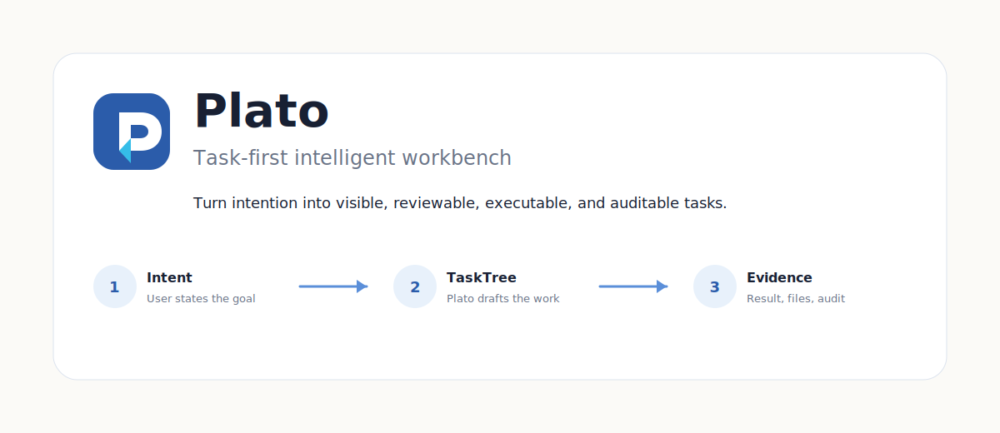
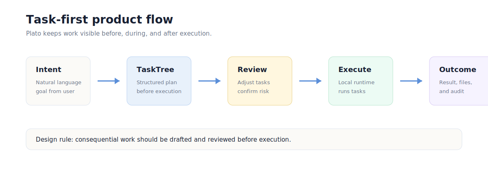
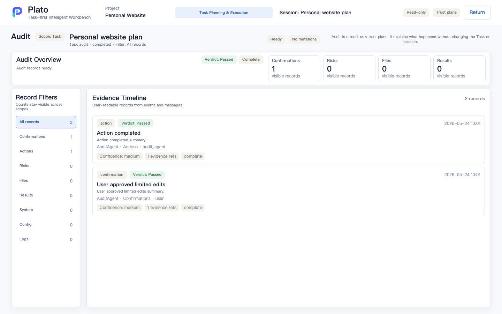
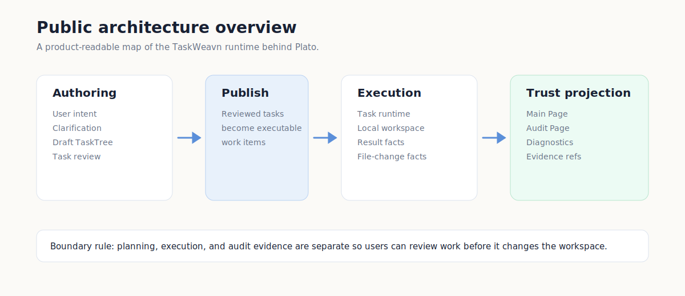

# Plato

Plato is a task-first intelligent workbench.

It turns a user's goal into a visible task structure, lets the user review and
confirm the work, executes through a local runtime, and keeps results, file
changes, and audit evidence inspectable.



## What Plato Is

Most AI tools make the conversation the main object. Plato makes the task the
main object.

```text
User intent
  -> Draft TaskTree
  -> Review and confirmation
  -> Local execution
  -> Result, file changes, and audit evidence
```

Plato is the user-facing product. TaskWeavn is the local task-agent runtime
behind it.

## Current Public Release

Version: `0.1.0`

Platform: macOS Apple Silicon (`macos-arm64`)

Download:

- [Plato-0.1.0-macos-arm64.dmg](https://github.com/zhanghao1903/plato-public/releases/download/v0.1.0/Plato-0.1.0-macos-arm64.dmg)

Integrity:

```text
34bc9a24dbf29c8ba5ebdeb1d92a4428d55e791562596e4303734b493fdfb212  Plato-0.1.0-macos-arm64.dmg
```

Release metadata:

- [manifest.json](releases/0.1.0/manifest.json)
- [SHA256SUMS](releases/0.1.0/SHA256SUMS)

Important status notes:

- This is an unsigned and non-notarized local release candidate.
- macOS may require opening it from Finder with the contextual Open action.
- The package includes a bundled Python sidecar runtime candidate.
- This public repository currently hosts public release metadata and product
  documentation. It is not a source-code mirror.

See [macOS local release usage](docs/usage/macos-local-release.md).

## Product Model



Plato is designed around a simple loop:

1. State a goal in natural language.
2. Review the generated task structure before meaningful work starts.
3. Confirm high-impact actions in context.
4. Track progress through task states.
5. Inspect the result, changed files, and audit trail.

Read more:

- [Product overview](docs/product/overview.md)
- [Task-first workflow](docs/product/task-first-workflow.md)
- [Release status](docs/product/release-status.md)

## Product Screens

The following screenshots use public-safe sample data captured from the local
Plato mock and sidecar flows.


The Main Page is the control plane for reviewing the plan, publishing tasks,
watching state, and opening audit.



The Audit Page is the read-only trust plane for evidence and traceability.


Workspace inspection shows repository status and file-level inspection links
using renderer-safe path labels. This screenshot is a public-safe local sidecar
capture; check [Release status](docs/product/release-status.md) before treating
this surface as available in a specific public release.

## Architecture Preview



Plato separates the work into four public concepts:

- Authoring: turn intent into a draft task structure.
- Publishing: move reviewed tasks into executable work.
- Execution: run tasks in a local workspace.
- Trust projection: show progress, results, file changes, and audit evidence.

Read more:

- [Architecture overview](docs/architecture/overview.md)
- [Trust and audit](docs/architecture/trust-and-audit.md)

## Public Visual Status

This repository includes public-safe explanatory diagrams and sanitized product
screenshots. Future releases should refresh screenshots when release status
changes and add a repository/social preview image.
