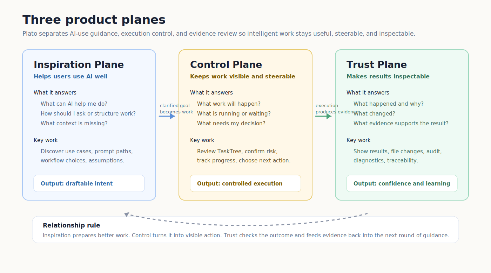
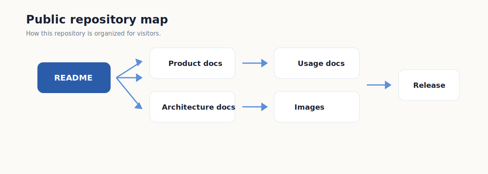

# Plato

Turn vague goals into visible task plans, run them locally, and inspect what
happened.

Plato is a task-first intelligent workbench. Instead of hiding work in a long
chat transcript, it turns a goal into a plan, lets you review and guide each
task, asks for confirmation when needed, and keeps an audit trail afterward.


## Try Plato

Public release channels for macOS Apple Silicon:

- Stable: [Plato-0.1.0-macos-arm64.dmg](https://github.com/zhanghao1903/plato-public/releases/download/v0.1.0/Plato-0.1.0-macos-arm64.dmg)
- Beta: [Plato-1.1-beta-macos-arm64.dmg](https://github.com/zhanghao1903/plato-public/releases/download/v1.1-beta/Plato-1.1-beta-macos-arm64.dmg)
- [Version comparison](docs/product/versions.md)
- [Quickstart](docs/usage/quickstart.md)
- [User guide](docs/usage/user-guide.md)
- [FAQ](docs/usage/faq.md)
- [中文文档](docs/zh/README.md)
- [Release notes](docs/releases/1.1-beta.md)

Important: both public channels are unsigned and non-notarized local releases.
macOS may require opening from Finder with the contextual Open action. See
[macOS local release usage](docs/usage/macos-local-release.md).

## Why Plato

Chat is good for conversation. Plato is built for work that needs planning,
confirmation, and trust.

| Common AI surface | Main object | What can go wrong |
|---|---|---|
| Chat assistant | Conversation | The plan, decisions, and results can disappear into a transcript. |
| Coding agent | Files and commands | The user may lose track of what is being changed and why. |
| Workflow tool | Forms and steps | The user must know the workflow before the system can help. |
| Plato | Task plan | The user sees the work structure, guides tasks, confirms risk, and checks evidence. |

Plato's product bet is simple: ordinary users should not need to understand
agents, tools, prompts, or runtime internals before they can stay in control.

## How It Works


1. Describe a goal in natural language.
2. Plato asks for missing context when it should not guess.
3. Plato drafts a visible task plan.
4. You review, refine, or publish the plan.
5. Plato runs approved work locally.
6. You inspect progress, results, file changes, and audit evidence.

Read the deeper model in [Task-first workflow](docs/product/task-first-workflow.md).

## What You Can Try Today

The current local beta is best for evaluating the task-first loop and the new
Product 1.1 inspection surfaces:

- turn a rough goal into a reviewable task plan;
- inspect task status and current activity;
- answer user-owned questions instead of letting the system guess;
- open a read-only Audit Page to understand evidence and traceability;
- review token usage analytics for local sessions and workspaces;
- use workspace inspection for git status, file diffs, and file viewing;
- rely on precision file tool foundations for line-range reads, search,
  hash-guarded replacements, and evidence-backed file operations.

For concrete examples, see [Use cases](docs/product/use-cases.md).

## Product Screens

The screenshots below use public-safe sample data.

### Control Plane: Main Page


The Main Page is where users review a plan, inspect tasks, publish work, track
status, and open audit.

### ASK: When Plato Needs The User


An Authoring ASK appears before the plan exists, when Plato needs context that
belongs to the user.


An Execution ASK appears during task work, when a task should pause instead of
guessing.

### Trust Plane: Audit Page


The Audit Page is a read-only trust surface for evidence, diagnostics, and
traceability.

### Workspace Inspection


Workspace inspection shows repository status and file-level inspection links
using renderer-safe path labels. In `1.1-beta`, the public release includes
git status, structured diff, and file viewer paths for local workspaces.

## Product Model



Plato is organized around three product planes:

| Plane | User question | Product role |
|---|---|---|
| Inspiration Plane | What can AI help me do, how should I use it, and what does Plato understand? | Helps users shape fuzzy goals into work that can be planned. |
| Control Plane | What work will happen, what is running, and what needs me? | Keeps plans, task state, confirmations, and results visible. |
| Trust Plane | What happened, why, and what evidence exists? | Makes results, file changes, audit records, and diagnostics inspectable. |

Start with [Product overview](docs/product/overview.md) if you want the product
thesis.

## For Users

- [Quickstart](docs/usage/quickstart.md): shortest path from download to first plan.
- [User guide](docs/usage/user-guide.md): how to use Plato's task-first loop.
- [FAQ](docs/usage/faq.md): safety, unsigned release, data, logs, and limits.
- [Privacy and safety](docs/security/privacy-and-safety.md): what the current
  local release does and does not guarantee.
- [Release status](docs/product/release-status.md): exact public release caveats.
- [中文文档](docs/zh/README.md): Chinese quickstart, user guide, FAQ, use
  cases, safety, and release notes.

## For Reviewers

- [Engineering highlights](docs/engineering/highlights.md): what this project
  demonstrates technically.
- [Architecture overview](docs/architecture/overview.md): public system shape.
- [Trust and audit](docs/architecture/trust-and-audit.md): how Plato earns user
  trust after work happens.
- [Version comparison](docs/product/versions.md): stable vs beta capabilities.
- [Release notes](docs/releases/1.1-beta.md): what shipped in the public
  `1.1-beta` local beta release.

## Public Version Channels

| Channel | Version | Best for | Download |
|---|---:|---|---|
| Stable | `0.1.0` | Conservative public baseline for the task-first product loop. | [Plato-0.1.0-macos-arm64.dmg](https://github.com/zhanghao1903/plato-public/releases/download/v0.1.0/Plato-0.1.0-macos-arm64.dmg) |
| Beta | `1.1-beta` | Latest Product 1.1 inspection foundations. | [Plato-1.1-beta-macos-arm64.dmg](https://github.com/zhanghao1903/plato-public/releases/download/v1.1-beta/Plato-1.1-beta-macos-arm64.dmg) |

Platform: macOS Apple Silicon (`macos-arm64`)

Beta integrity:

```text
bdf1d719546c84569dae4c6610ed9a609acb77c971d00a938ff59c6510caa6e1  Plato-1.1-beta-macos-arm64.dmg
```

Release metadata:

- [Version comparison](docs/product/versions.md)
- [manifest.json](releases/1.1-beta/manifest.json)
- [SHA256SUMS](releases/1.1-beta/SHA256SUMS)

Status notes:

- unsigned and non-notarized;
- local release candidate, not a polished app-store release;
- includes a bundled Python sidecar runtime candidate;
- this repository hosts release metadata and public docs, not source code.

## Current Limitations

- The release is intended for early evaluation.
- Signing, notarization, auto-update, and broad platform packaging are not yet
  complete.
- Some screenshots show public-safe development previews; release availability
  is tracked in [Release status](docs/product/release-status.md).
- Plato is not positioned as a one-click autonomous worker. The current product
  direction is visible planning, local execution, user confirmation, and audit.

## Repository Map

```text
docs/
  product/       Product thesis, workflow, use cases, release status.
  usage/         Quickstart, user guide, macOS local release help, FAQ.
  architecture/  Public architecture, trust, and audit model.
  engineering/   Reviewer-facing technical highlights.
  security/      Privacy and safety notes for the public release.
  releases/      Human-readable release notes.
assets/
  images/        Product and architecture diagrams.
  screenshots/   Public-safe UI screenshots.
releases/
  0.1.0/         Machine-readable manifest and checksum files.
  1.1-beta/      Machine-readable manifest and checksum files.
```


