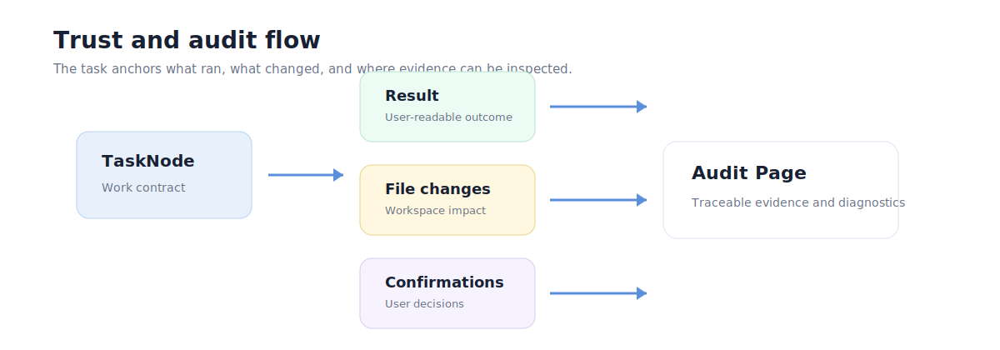
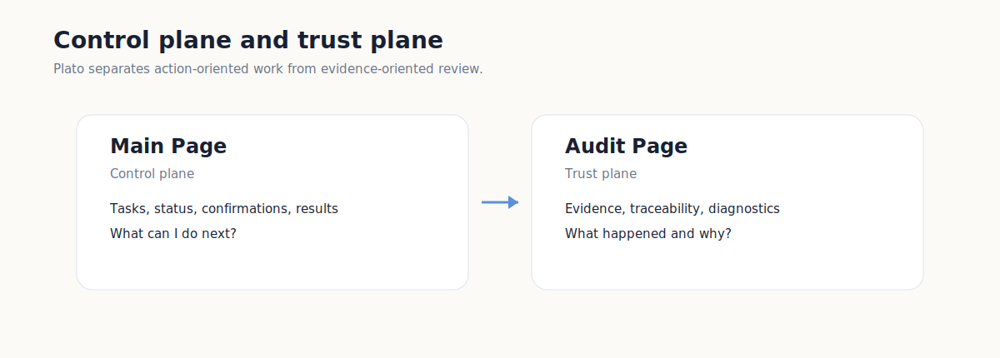

# Trust And Audit

Plato treats trust as a product surface, not only an implementation detail.

The user should be able to understand what was planned, what ran, what changed,
and where to inspect evidence.

## Product Plane Context

Trust is one of Plato's three product planes:

- Inspiration Plane: clarify what the user needs before work is planned.
- Control Plane: keep planned and running work visible.
- Trust Plane: preserve the evidence needed to evaluate what happened.

This document focuses on the Trust Plane and how it connects back to control.

## Control Plane And Trust Plane

| Surface | Role |
|---|---|
| Main Page | Shows current work, task status, confirmations, results, and file-change summaries. |
| Audit Page | Shows traceable evidence for what happened and why. |

The Main Page should remain action-oriented. The Audit Page can be more
complete and precise.

## Evidence Anchors

Public Plato docs use these evidence anchors:

- Task: the unit of planned and executed work.
- Result: user-readable outcome of a task or session.
- File change: what changed in the local workspace.
- Audit entry: evidence trail for actions, confirmations, and runtime facts.
- Diagnostics: support-oriented package of redacted runtime information.

## Workspace Inspection Direction

Workspace inspection is the next trust-building direction:

- repository status;
- changed files;
- per-file diff;
- text file viewing;
- captured evidence references.

The public screenshot uses a local sample workspace and renderer-safe path
labels:

Release-specific availability should still be checked against
[Release status](../product/release-status.md).

## Public Safety Rule

Public docs and screenshots must not expose:

- private file paths;
- local usernames;
- API keys or provider secrets;
- raw diagnostic logs;
- customer or user-generated content;
- private repository URLs.
