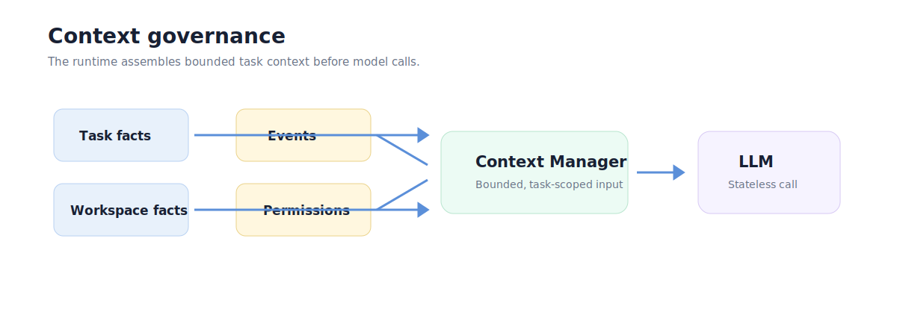

# Engineering Highlights

This page is for technical reviewers and recruiters who want to understand what
Plato demonstrates beyond the UI.

The public repository is not a source-code mirror, so this page describes
engineering decisions at a product-safe level.

## 1. Task-First Product Architecture

Plato is built around the idea that the task is the primary user-visible work
contract.

That creates a different architecture from a plain chat interface:

- planning is separate from execution;
- user questions are scoped to authoring or a task;
- progress is projected as task state;
- result, file changes, and audit evidence attach back to the work structure.

This makes the product easier to reason about for ordinary users and easier to
test for engineers.

## 2. Local Desktop App With Bundled Sidecar

The `0.1.0` public release packages a desktop UI with a bundled Python sidecar
runtime candidate.

Why this matters:

- the UI can remain responsive while runtime work happens locally;
- the app can be evaluated without asking users to clone a source repository;
- release assets can be checksummed and verified;
- local-first workflows can be explored before cloud distribution.

See [Release status](../product/release-status.md).

## 3. Main Page As Product Projection

The Main Page is not a raw log viewer. It is a product projection of session,
plan, task, message, and state facts.

That projection is designed to answer:

- What plan exists?
- Which task is selected?
- What needs the user's attention?
- What can the user do now?
- Where can the user inspect evidence?

This keeps internal runtime complexity out of the primary UX.

## 4. Audit Page As Trust Plane

The Audit Page is intentionally read-only. It exists to help users understand
what happened without mutating the task or session.

Engineering implications:

- audit evidence is separate from control actions;
- evidence can be filtered and inspected without changing state;
- disclosure rules can hide or partially reveal sensitive payloads;
- trust can improve over time without overloading the Main Page.

Read more in [Trust and audit](../architecture/trust-and-audit.md).

## 5. ASK And Confirmation As Different Concepts

Plato separates ASK from confirmation.

- ASK means the system lacks user-owned information and should not guess.
- Confirmation means the system knows the action but needs approval.

This distinction reduces accidental automation and makes the UI more legible.

## 6. Context Governance

LLM calls are stateless, but Plato sessions are stateful. The runtime needs to
assemble bounded context from task, workspace, recent messages, events,
permissions, and results before model calls.

The public architecture describes this as context governance:

The goal is to avoid invisible chat memory becoming the only source of truth.

## 7. Release Discipline

The public release process includes:

- GitHub Release asset for the large DMG;
- machine-readable release manifest;
- SHA256 checksum file;
- explicit unsigned/non-notarized caveat;
- public release notes separate from raw metadata.

The public repository intentionally avoids committing the large DMG to Git.

## 8. What This Demonstrates

For reviewers, Plato demonstrates:

- product thinking around task-first AI UX;
- local desktop packaging of a sidecar runtime;
- separation of control and trust surfaces;
- careful release boundary communication;
- audit-oriented design rather than blind automation;
- public documentation that distinguishes shipped, preview, roadmap, and
  conceptual claims.
