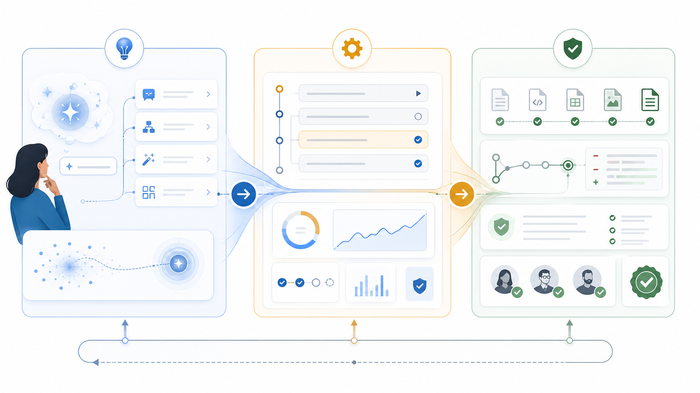
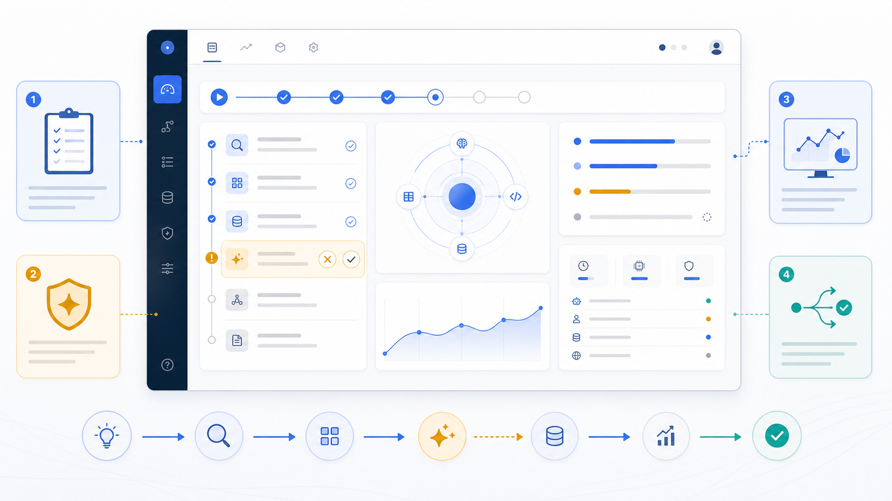
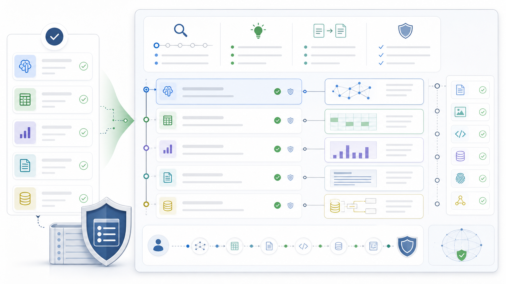

# Plato Product Overview

Plato is a task-first intelligent workbench for local AI-assisted work.

The product is built around one belief: intelligent work should be understood,
controlled, and trusted by the user at every step.

## Product Thesis

Plato turns unclear intent and unclear AI usage into structured, reviewable
work:

```text
Natural language goal
  -> AI use and workflow guidance
  -> Clarification when needed
  -> TaskTree
  -> TaskNode review
  -> Confirmed execution
  -> Result and evidence
```

The main object is not a chat transcript, an agent, or a file tree. The main
object is the task.

A task is a visible work contract:

- before execution, it is a plan the user can inspect;
- during execution, it is delegated work under user supervision;
- after execution, it anchors the result, file changes, and audit trail.

## The Three Product Planes



Plato presents this contract through three product planes.

| Plane | Primary question | Product responsibility |
|---|---|
| Inspiration Plane | What can AI help the user do, how should the user use it, and what does Plato understand? | Helps the user discover AI use cases, choose prompt/workflow paths, clarify context, expose assumptions, and prepare a draftable work shape. |
| Control Plane | What work will happen, what is happening now, and what needs the user? | Shows TaskTree review, task state, confirmations, progress, result actions, and next steps. |
| Trust Plane | What happened, why, and what evidence exists? | Shows results, changed files, audit records, diagnostics, and traceability after execution. |

### Inspiration Plane


The Inspiration Plane is where the product begins understanding the user.

It is not a marketing surface. It is the product space for AI-use discovery and
intent discovery. The user may not know what AI can help with, which workflow
fits the situation, how much context to provide, or why different prompts can
produce very different results from the same agent application.

The Inspiration Plane should help the user:

- discover useful AI-assisted work patterns;
- understand what AI can and cannot help with in the current context;
- choose or shape an appropriate prompt and workflow;
- provide missing constraints, examples, files, or preferences;
- see assumptions before work becomes a plan;
- decide whether the goal is ready to become a TaskTree.

This plane matters because the most expensive failure happens before execution:
the user may underuse AI, use it poorly, or ask the system to solve the wrong
problem. Plato should make uncertainty visible early, before the user is asked
to confirm or run work.

This is also a product gap today. Plato's future direction is to make this
plane much stronger.

### Control Plane



The Control Plane is the user's action surface.

It should answer:

- what goal or workflow is active;
- what task structure Plato proposes;
- which tasks need review, confirmation, or input;
- what is queued, running, completed, failed, or waiting;
- what result was produced;
- what the user can do next.

The Main Page is the primary Control Plane. It should stay action-oriented and
avoid exposing every internal implementation detail.

### Trust Plane



The Trust Plane is the evidence surface.

It should answer:

- what was planned;
- what ran;
- what changed;
- what the user confirmed;
- what evidence supports the result;
- where risks, failures, or missing evidence can be inspected.

The Audit Page is the primary Trust Plane. It can be more complete and precise
than the Main Page because it exists for traceability, review, and debugging.

## Why Three Planes

Plato needs three planes because AI-assisted work has three separate user
risks:

1. AI-use uncertainty: the user may not know what AI can help with, how to ask,
   which workflow to use, or what context changes the output quality.
2. Loss of control: the system may move from plan to action without enough
   user-visible structure.
3. Lack of trust: the system may produce an answer or file change that the user
   cannot verify.

A single chat thread collapses these risks into one surface. Plato separates
them so each part can be designed with the right level of detail:

- the Inspiration Plane can slow down and ask better questions;
- the Control Plane can stay concise and action-oriented;
- the Trust Plane can preserve evidence without overwhelming the main work
  surface.

## Product Direction

The next product emphasis is the Inspiration Plane.

This is the start of useful AI-assisted work: helping the user recognize where
AI is useful, shape better prompts, choose better workflows, clarify goals,
surface assumptions, collect constraints, and decide whether a request is ready
to become a task structure. A stronger Inspiration Plane should make the rest
of the product safer: better plans, fewer misplaced confirmations, clearer
execution, and more meaningful audit evidence.

## What Plato Prioritizes

Plato prioritizes:

- legibility before automation;
- helping users understand how to use AI effectively before asking them to
  execute work;
- clarification before planning when the user's goal is incomplete;
- review before consequential execution;
- task-scoped confirmation instead of context-free popups;
- visible result and file-change summaries;
- audit evidence for trust and debugging;
- local-first execution for early releases.

Plato does not position the `0.1.0` release as a broad autonomous worker, a
multi-agent marketplace, or a source-code distribution.

## Current Release Status

The current public release is `0.1.0`, an unsigned and non-notarized macOS
Apple Silicon local release candidate.

For exact release metadata, see [Release status](release-status.md).

## Public Screenshots

Current public-safe screenshots:

- [Main Page](../../assets/images/plato-main-page.png)
- [Audit Page](../../assets/images/plato-audit-page.png)
- [Workspace Inspection](../../assets/images/plato-workspace-inspection.png)
