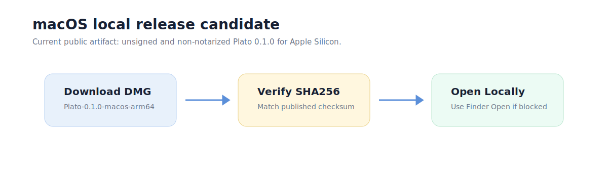

# macOS Local Release Usage

This page explains how to use the public macOS local releases.

## Download

Download the latest beta asset:

- [Plato-1.1-beta-macos-arm64.dmg](https://github.com/zhanghao1903/plato-public/releases/download/v1.1-beta/Plato-1.1-beta-macos-arm64.dmg)



Verify the checksum if needed:

```text
bdf1d719546c84569dae4c6610ed9a609acb77c971d00a938ff59c6510caa6e1  Plato-1.1-beta-macos-arm64.dmg
```

## Open

The `1.1-beta` release is unsigned and non-notarized.

macOS may block a normal double-click open. For local evaluation, mount the DMG
and use Finder's contextual Open action if Gatekeeper blocks the first launch.

## Status Caveats

- The app is a local beta release.
- The package includes a bundled Python sidecar runtime candidate.
- Signing and notarization are not complete for this release.
- The public repository hosts release metadata and public docs, not private
  source code or internal diagnostics.

After opening Plato, see the [user guide](user-guide.md) for the basic product
loop.

If this is your first time trying Plato, start with the
[Quickstart](quickstart.md). For stable/beta differences, see
[Public versions](../product/versions.md). For release safety questions, see
the [FAQ](faq.md) and [Privacy and safety](../security/privacy-and-safety.md).

## Troubleshooting

If the app does not open:

1. Confirm you downloaded the macOS Apple Silicon asset.
2. Confirm the checksum matches the published SHA256 value.
3. Try opening from Finder with the contextual Open action.
4. Check [Release status](../product/release-status.md) for current caveats.
