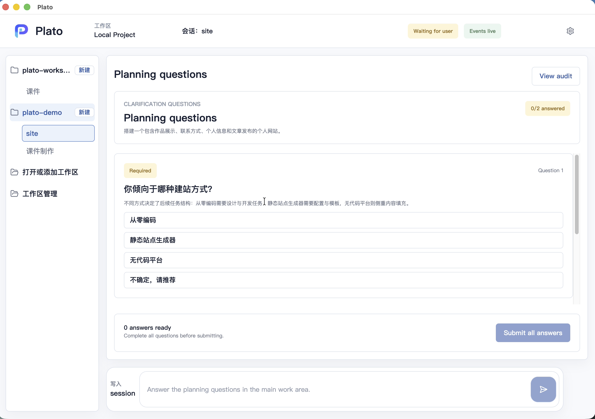

# Plato Quickstart

This is the shortest path from download to a first useful Plato session.

## 1. Download The Local Beta

Download the current beta macOS Apple Silicon asset:

- [Plato-1.1-beta-macos-arm64.dmg](https://github.com/zhanghao1903/plato-public/releases/download/v1.1-beta/Plato-1.1-beta-macos-arm64.dmg)

Optional checksum:

```text
bdf1d719546c84569dae4c6610ed9a609acb77c971d00a938ff59c6510caa6e1  Plato-1.1-beta-macos-arm64.dmg
```

The release is unsigned and non-notarized. If macOS blocks the first launch,
see [macOS local release usage](macos-local-release.md).

If you need the stable baseline instead, see
[Public versions](../product/versions.md).

## 2. Open Plato

Mount the DMG and open Plato.

On first use, treat the app as a local beta:

- use a test workspace first;
- avoid sensitive files until you understand the flow;
- inspect audit and file-change surfaces before trusting output.

## 3. Start With A Goal

Create or select a session, then describe the outcome you want.

Good first prompts:

- "Help me plan a small personal website."
- "Turn this rough idea into tasks I can review."
- "Help me prepare a safe set of steps before changing files."
- "Draft a plan for creating a short courseware page."

You do not need a perfect prompt. Plato is designed to ask for missing context
when it should not guess.

## 4. Review The Plan

Plato should turn the goal into a visible task plan.

Before publishing, check:

- whether the plan matches your intent;
- whether the tasks are understandable;
- whether the order makes sense;
- whether any task needs extra guidance.

If the plan is wrong, refine it before running work.


## 5. Answer ASK Questions

ASK is different from normal chat.

Plato uses ASK when it needs information that belongs to you and should not be
guessed.

- Authoring ASK appears before a plan is ready.
- Execution ASK appears when a task is blocked during work.



## 6. Publish And Inspect

When the plan looks right, publish it and watch task progress.

After work happens, inspect:

- task status;
- result summary;
- changed files, when available;
- Audit Page evidence.
- workspace inspection for git status, file viewing, and diffs.


## 7. Know The Current Limits

The `1.1-beta` public release is useful for early evaluation, but it is not a
fully polished public distribution.

Current caveats:

- macOS signing and notarization are not complete;
- broad platform support is not available;
- some screenshots show development previews;
- the repository hosts public docs and release assets, not source code.

Read next:

- [User guide](user-guide.md)
- [FAQ](faq.md)
- [Public versions](../product/versions.md)
- [Release status](../product/release-status.md)
- [Privacy and safety](../security/privacy-and-safety.md)
- [1.1-beta release notes](../releases/1.1-beta.md)
