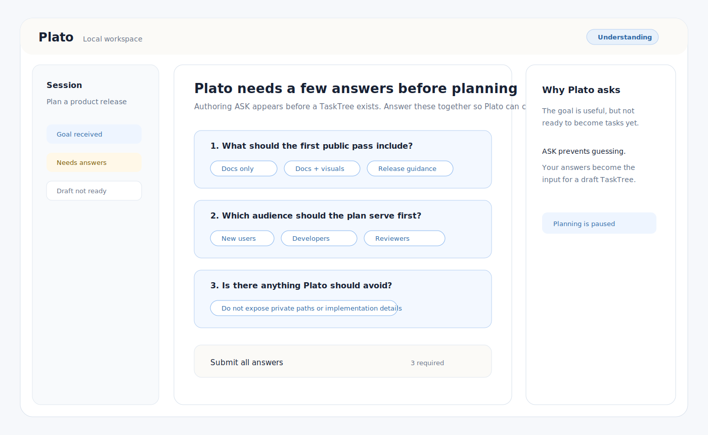
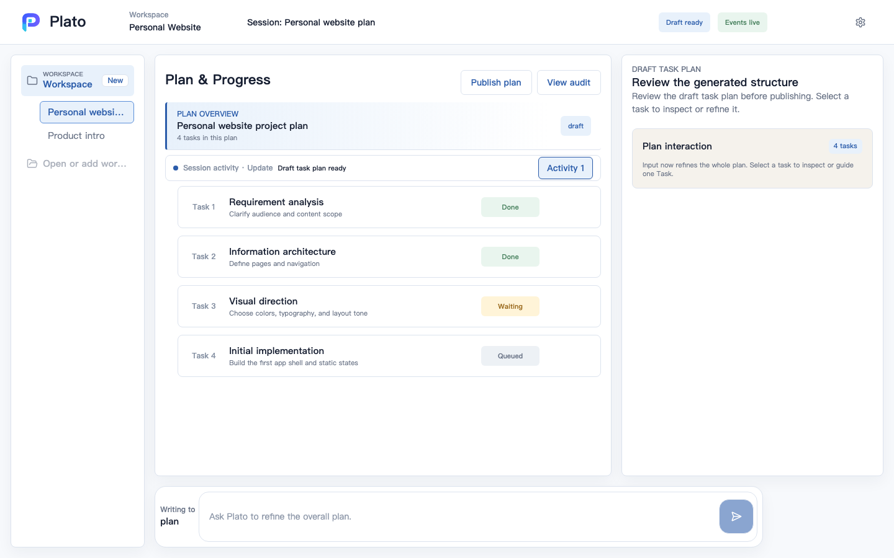
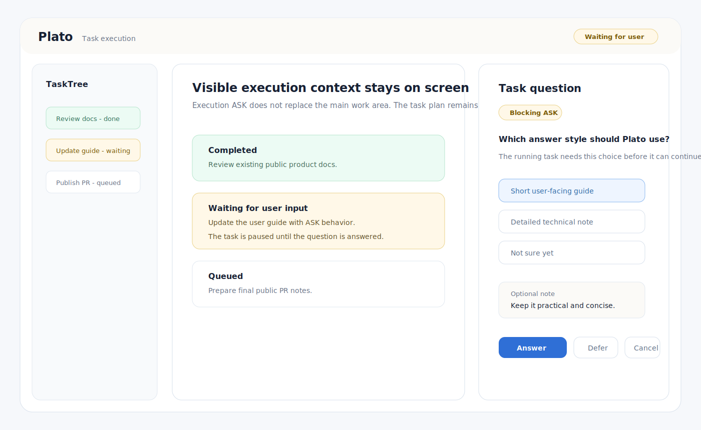
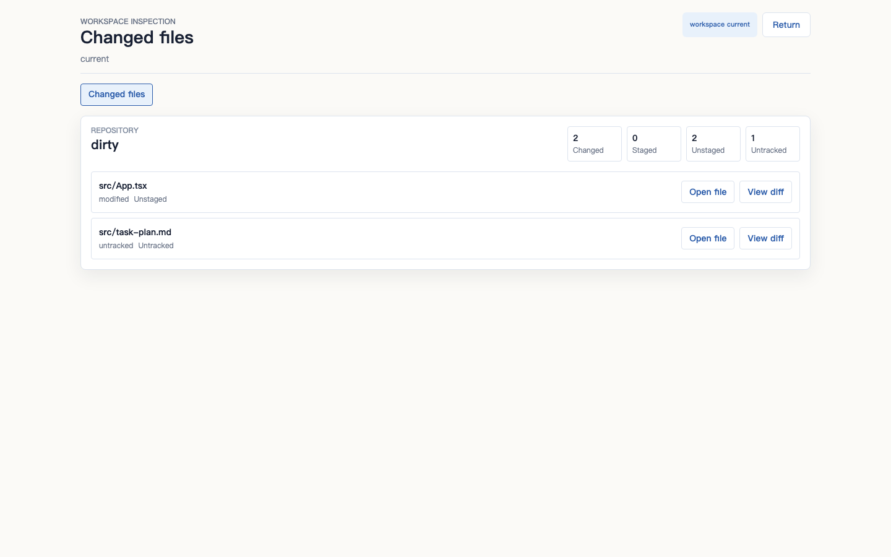

# Plato 用户指南

这份指南用用户语言解释如何使用 Plato。

Plato 适合这样的工作：你知道想要的结果，但不一定知道如何向 AI 提问、如何拆分任务、哪些步骤需要确认，以及如何检查最终结果是否可信。

如果你想先走最短路径，请从 [快速开始](quickstart.md) 读起。如果你不确定当前版本是否适合日常使用，请阅读 [常见问题](faq.md) 和 [隐私与安全](../security/privacy-and-safety.md)。

## 演示视频

下面三个公开视频覆盖从安装到执行的完整路径：

| 步骤 | 视频 |
|---|---|
| 安装 Plato | [Plato 安装视频](https://www.bilibili.com/video/BV1F3JW6QEqw) |
| 制定并检查计划 | [Plan 制定演示视频](https://www.bilibili.com/video/BV19SJs6yE3q) |
| 执行任务并查看进度 | [Plato 任务执行演示视频](https://www.bilibili.com/video/BV1zJJN6YE6N/) |

视频托管在 Bilibili。GitHub Markdown 不会渲染 Bilibili iframe 播放器，所以请使用上面的链接观看。下面的文字指南用于在观看视频后快速对照产品概念和操作路径。

## 1. 从结果开始

先描述你想完成什么，而不是一开始就追求完美 prompt。

适合的起点包括：

- "帮我把这个粗略想法变成一个具体计划。"
- "检查这个 workspace，并告诉我下一步应该做什么。"
- "在修改文件前，帮我先准备一组安全步骤。"
- "总结结果，并告诉我发生了哪些变化。"

Plato 的启发面目标之一，就是帮助用户理解 AI 能做什么、应该如何使用 AI，以及补充哪些上下文会让结果更好。

## 2. 让 Plato 帮你整理工作

Plato 不应该把你的第一句话直接当作执行许可。

在真正执行之前，Plato 会尝试把目标整理成更清晰的任务结构。它可能会识别缺失信息、暴露假设，或者先展示一个计划草稿。

有用的上下文包括：

- 你关心的目标或结果；
- 文件、项目或主题边界；
- 哪些内容不应该被修改；
- 好结果的例子；
- 时间、质量或风险约束。

当 Plato 需要这些信息才能制定有用计划时，它应该直接提问。这类问题是 Authoring ASK。

## 3. 检查计划

Main Page 是控制面。

你可以在这里检查：

- Plato 理解的任务是什么；
- 计划包含哪些步骤；
- 哪些任务在等待、运行、完成或失败；
- 哪些地方需要你的输入；
- 是否已有结果或文件变化。

如果计划和你的意图不一致，先调整目标或计划，再继续执行。

## 4. 确认有风险的步骤

对于影响较大的工作，Plato 应该在继续前询问你。

确认操作应该尽量靠近它影响的任务，让你能在上下文中判断，而不是只看到一个孤立弹窗。

常见需要确认的动作包括：

- 修改文件；
- 运行有风险的命令；
- 使用敏感输入；
- 在结果不完整或不确定时继续。

ASK 和 confirmation 不一样。confirmation 表示 Plato 知道要做什么，但需要你批准。ASK 表示 Plato 缺少信息，不应该自己猜。

执行过程中，Plato 也可能在某个任务里提出问题。这是 Execution ASK，需要你在任务详情面板中回答。

## 5. 检查结果

任务完成后，不要只看最终回答。

建议检查：

- 结果摘要；
- 如果有文件变更，检查变更内容；
- 任务状态和失败原因；
- 需要理解发生了什么时，查看 Audit Page 证据。

在 `1.1-beta` 通道中，也可以检查 Product 1.1 的基础检查能力：

- AI 活动后的 token 用量摘要；
- workspace inspection 中的 Git 状态、diff 和文件查看；
- precision file tools 产生的文件操作证据。

Audit Page 是信任面。它用于查看证据，不用于控制任务。

workspace inspection 在截图和发布文档中使用公开安全的路径标签：

## 6. 继续、修改或停止

看到结果后，可以选择下一步：

- 如果结果符合目标，接受结果；
- 继续补充指导；
- 如果方向不对，修改计划；
- 在信任输出前检查证据；
- 如果请求不再有用或不安全，停止任务。

## 当前版本说明

公开通道是未签名、未公证的 macOS 本地版本。部分截图可能展示产品方向或公开安全的示例流程。具体能力请以 [公开版本](../product/versions.md) 和 [1.1-beta 发布说明](../releases/1.1-beta.md) 为准。
